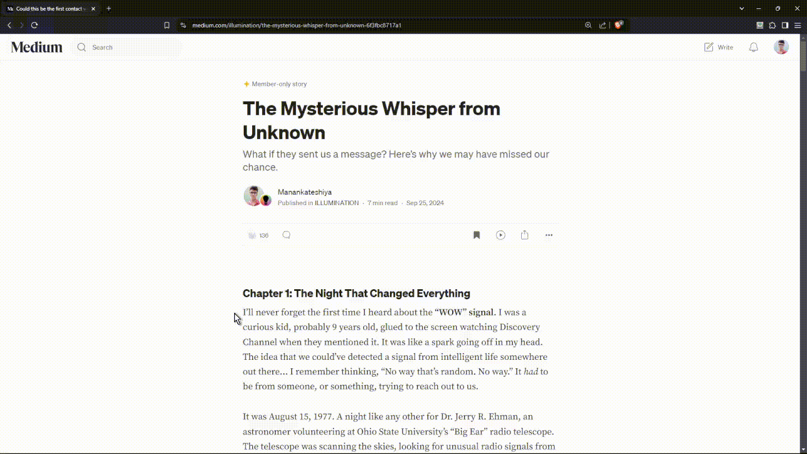
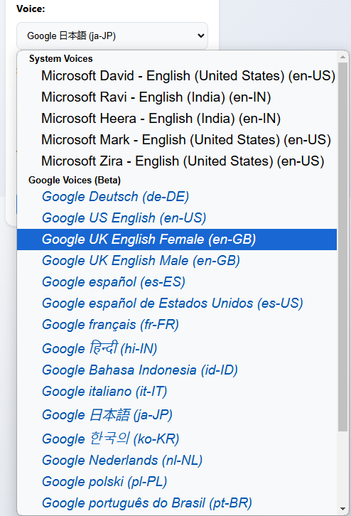

# Read Aloud V2 - Browser Extension by Manan Kateshiya

**Read Aloud V2** is a simple and fast Chrome extension that converts selected text from any webpage into spoken words. With just a click or a right-click, you can easily listen to any webpage content, making it perfect for users who prefer audio over text or have visual impairments.  
  
  

---

# Features

## Easy-to-Use User Interface
A simple, intuitive interface that makes it easy for anyone to start using the extension right away.  

## More Than 20 Voices for Different Languages
Choose from over 20 voices in different languages to suit your preferences and needs.  

## Media Player with Play/Pause Controls
The media player shows the duration with a sleek, modern design. Easily control playback with play, pause, or stop buttons, and see the remaining time.  

## Text Highlighting to Keep Up with TTS
The extension highlights the text as it’s read aloud, ensuring you can follow along and never lose track of the speech.  

---

# Installation

### Method 1: Install from the Chrome Web Store (Coming soon)

You will be able to download **Read Aloud V2** directly from the Chrome Web Store once it's published.

### Method 2: Install Manually (For Developers)

1. Clone or download this repository to your local machine.
2. Open your preferred browser and go to `chrome://extensions/`.
3. Enable **Developer mode** (toggle at the top right).
4. Click **Load unpacked** and select the folder where you downloaded the extension.
5. The extension should now appear in your extensions list.

---

## Usage

1. **Click on the extension icon** to open the settings.
2. **Select a voice** from the dropdown menu.
3. **Set your preferences** by adjusting speed, pitch, and volume.
4. **Select Text**: Highlight the text you want to be read aloud on any webpage.
5. **Activate the Extension**:
   - **Right-click** on the selected text and choose **"Read Aloud Selected Text"** from the context menu.
6. **Listen**: The selected text will start being read aloud using the built-in text-to-speech engine.

---

## Permissions

The extension requires the following permissions to function:

- **contextMenus**: To add a custom item in the browser's context menu when you right-click on selected text.
- **storage**: To store user preferences (e.g., voice, speed, language).
- **scripting**: To inject scripts into the page for text-to-speech functionality.
- **tts**: To use the built-in Chrome text-to-speech engine.
- **ttsEngine**: To integrate with custom text-to-speech engines (if applicable).
- **<all_urls>**: Access to all URLs is required to read text from any webpage.

---

## Contributing

Feel free to contribute to **Read Aloud V2**! Here’s how you can help:

1. **Fork the repository**.
2. **Clone** your forked repository to your local machine.
3. **Create a new branch** for your feature or bug fix.
4. **Commit your changes** and push them to your forked repository.
5. **Open a Pull Request** to the main repository.

---

## License

This project is licensed under the MIT License - see the [LICENSE](LICENSE) file for details.

---

## Contact

For any inquiries or support, feel free to open an issue on GitHub, or contact me at [contact@manankateshiya.com](mailto:contact@manankateshiya.com).

---

## Acknowledgments

- **Google Chrome APIs**: For providing the built-in text-to-speech functionality and context menu features.

---
